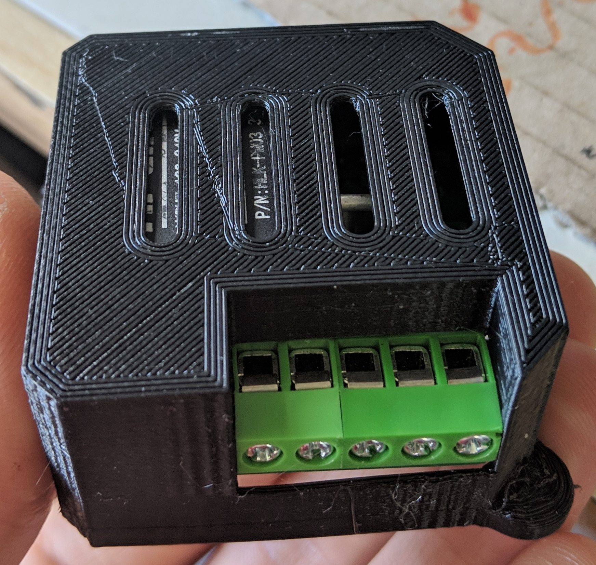

# AC Dimmer Addon
This is a custom made 2 channel AC dimmer addon which fits on the back of the [Wireless sensor board](https://github.com/JDomotic/esp12-wireless-sensor-board) .

The board can receive commands over uart with configurable transition speed per channel. 
It also has a 230VAC button input and a 230VAC power meter

## Version 1 | 05-01-2019
**Features**:
* Onboard 1A 3.3v AC power supply
* Zero cross detection 
* Two triac for 230VAC dimming with a total power of 4 amps (or 2*2 amps)
* Input for a 230VAC button 
* 230VAC power meter  
* Small formfactor, fits in electric wall boxes 

**Schematic**

**BOM**

**Ref**|**Qnty**|**Value**|**Footprint**|**Vendor (LCSC)**
:-----: | :-----: | :-----: | :-----: | :-----:
C1,|1|1nF|Capacitor\_SMD:C\_1206\_3216Metric\_Pad1.42x1.75mm\_HandSolder|C152975
C2,|1|10uF/10V|Capacitor\_THT:CP\_Radial\_D4.0mm\_P2.00mm|C191532
C7,|1|0.1uf|Capacitor\_SMD:C\_1206\_3216Metric\_Pad1.42x1.75mm\_HandSolder|C128353
C8,|1|100nF 450v|Capacitor\_SMD:C\_1206\_3216Metric\_Pad1.42x1.75mm\_HandSolder|C106025
D1,|1|1N4148|Diode\_SMD:D\_SOD-123|C184882
D2,|1|MB6S|Package\_TO\_SOT\_SMD:TO-269AA|C83867
F1,|1|Glass fuse 10mm 4A|Resistor\_THT:R\_Axial\_DIN0411\_L9.9mm\_D3.6mm\_P12.70mm\_Horizontal|C140492
J1,|1|Screw\_Terminal\_01x05|TerminalBlock\_RND:TerminalBlock\_RND\_205-00279\_1x05\_P5.00mm\_Vertical|C163149
J1,|1|Screw\_Terminal\_01x05|TerminalBlock\_RND:TerminalBlock\_RND\_205-00279\_1x05\_P5.00mm\_Vertical|C163148
J2,|1|Conn\_01x02\_Male ZMCT|Connector\_PinHeader\_2.54mm:PinHeader\_1x02\_P2.54mm\_Vertical|-
J3,|1|Conn\_01x05\_Male|Connector\_PinHeader\_2.54mm:PinHeader\_1x05\_P2.54mm\_Vertical|-
J4,|1|Conn\_01x05\_Male RIGHT|Connector\_PinHeader\_2.54mm:PinHeader\_1x05\_P2.54mm\_Vertical|-
J5,|1|Programm header|Connector\_PinHeader\_2.54mm:PinHeader\_1x04\_P2.54mm\_Vertical|-
Q1, Q2,|2|BT136-600D|Package\_TO\_SOT\_THT:TO-220-3\_Vertical|C130426
Q1, Q2,|2|TO-220 heatsink|TO-220 heatsink|C4650
Q5,|1|2N3904|Package\_TO\_SOT\_SMD:SOT-23|C18536
R1, R2, R16, R17,|4|180 0.25W 200v|Resistor\_SMD:R\_1210\_3225Metric\_Pad1.42x2.65mm\_HandSolder|C171148
R3, R4, R12,|3|100|Resistor\_SMD:R\_0805\_2012Metric\_Pad1.15x1.40mm\_HandSolder|-
R5,|1|4.7K|Resistor\_SMD:R\_0805\_2012Metric\_Pad1.15x1.40mm\_HandSolder|C328399
R6, R7,|2|220K 0.25W 200v|Resistor\_SMD:R\_0805\_2012Metric\_Pad1.15x1.40mm\_HandSolder|C352118
R8, R11, R13,|3|1K|Resistor\_SMD:R\_0805\_2012Metric\_Pad1.15x1.40mm\_HandSolder|C95781
R9,|1|22K|Resistor\_SMD:R\_0805\_2012Metric\_Pad1.15x1.40mm\_HandSolder|-
R10,|1|1K|Resistor\_SMD:R\_1206\_3216Metric\_Pad1.30x1.75mm\_HandSolder|C175514
R14,|1|10K|Resistor\_SMD:R\_0805\_2012Metric\_Pad1.15x1.40mm\_HandSolder|C103904
R15,|1|DNS|Resistor\_SMD:R\_0805\_2012Metric\_Pad1.15x1.40mm\_HandSolder|C103904
U1,|1|HLK-PM02|Power\_Supply:HLK-PM03| 
U2, U3,|2|MOC3052|Package\_DIP:SMDIP-6\_W7.62mm|C115471
U4,|1|4N35|Package\_DIP:SMDIP-6\_W7.62mm|C115444
U6,|1|ATTINY414-SSNR|Package\_SO:SOIC-14\_3.9x8.7mm\_P1.27mm|C189365
U7,|1|H11AA1SM|Package\_DIP:SMDIP-6\_W7.62mm|C184383

**Render**

**Assembled**

Assembeled with 1 triac (lower height):

Assembeled with 2 triacs:

**Issues**

There are a few issues with the board: 
1. The wrong SOT-23 footprint is used. Due this, the transistor Q5 needs to be soldered upside down (This because pin 1 and 2 are flipped) 
2. R14 and R5 references are swapped on the PCB silkscreen. 
3. Due a fault in the schematic, the button input cannot work. To fix this, leg number 6 of U7 must be cut off and pad 5 and 6 should be soldered together.  

